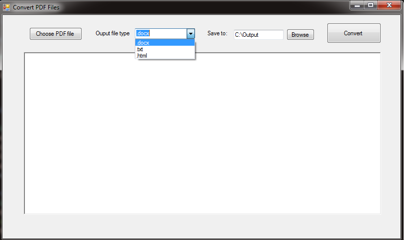

# ConvertPDF
ConvertPDF is an application that uses to convert PDF files to different type of files such as .docx, .txt, or .html

## Status
First version released for converting pdf file to .docx
Currently working on converting other types of files.



## Installation
Windows:

```sh
run setup.exe
```

## Release History

* 1.0.0.0
    * published first version with converting pdf file to .docx file
* 1.0.0.1
    * Working on adding more output file types.


## Meta

Your Name – [@Website](https://www.danielnguyen.xyz) – Danieltn91@gmail.com

Distributed under the XYZ license. See ``LICENSE`` for more information.

[https://github.com/yourname/github-link](https://github.com/dbader/)

## Contributing

1. Fork it (<https://github.com/codeskiller/ConvertPDF/fork>)
2. Create your feature branch (`git checkout -b feature/fooBar`)
3. Commit your changes (`git commit -am 'Add some fooBar'`)
4. Push to the branch (`git push origin feature/fooBar`)
5. Create a new Pull Request

<!-- Markdown link & img dfn's -->
[wiki]: https://github.com/codeskiller/ConvertPDF/wiki
